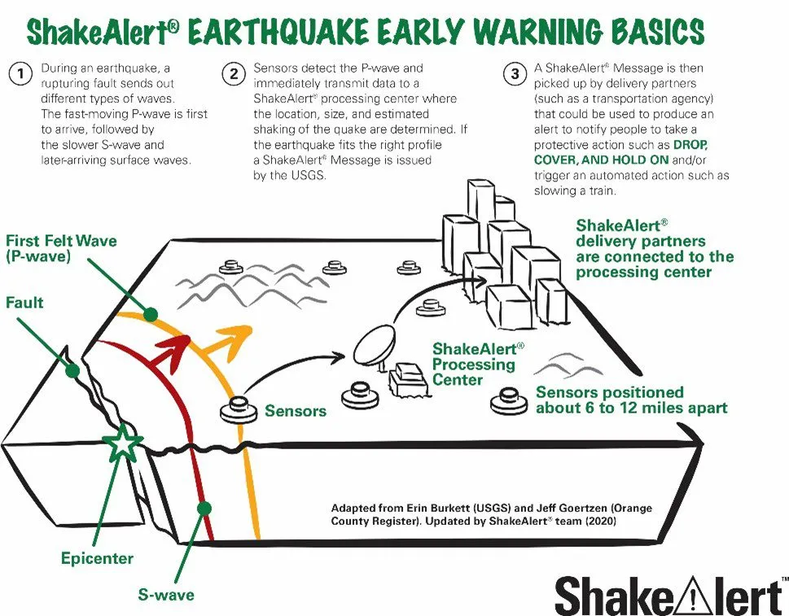
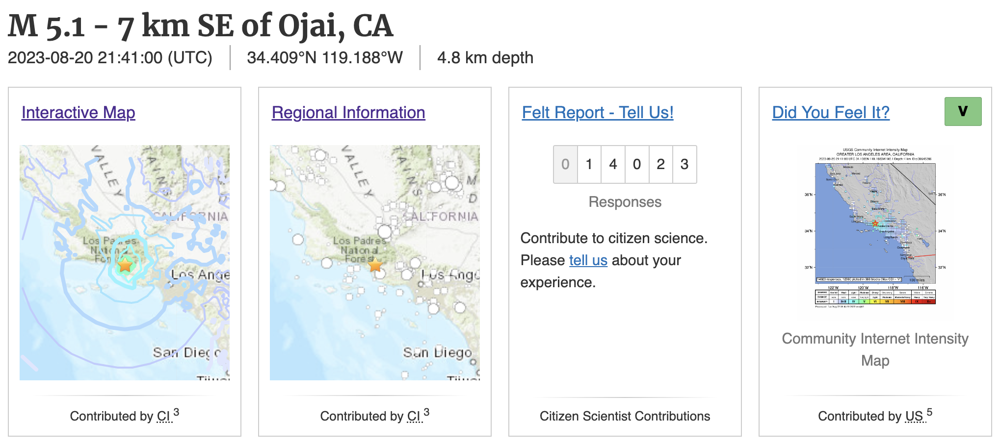
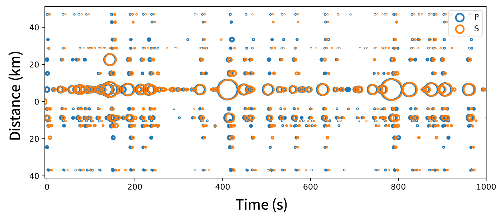
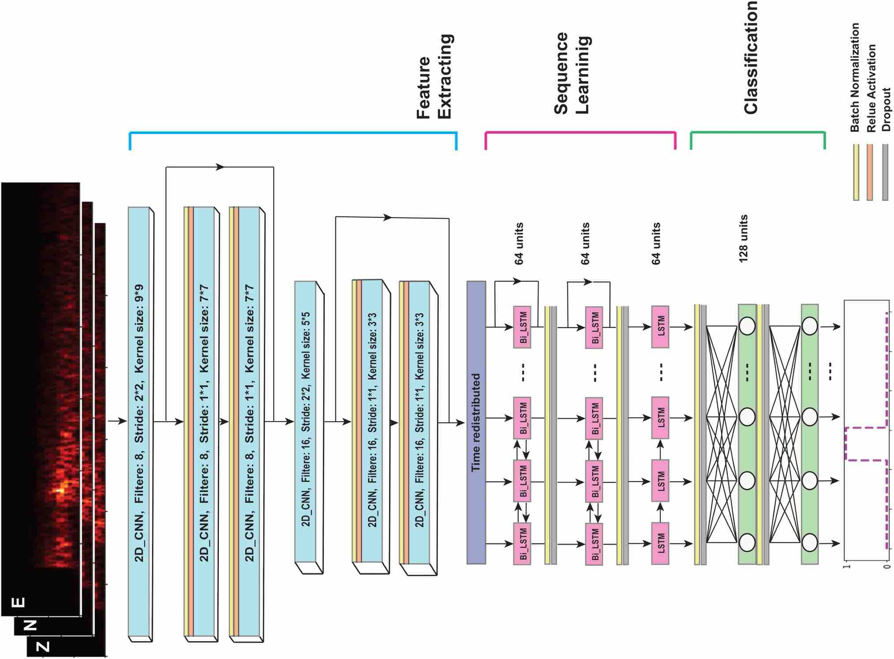
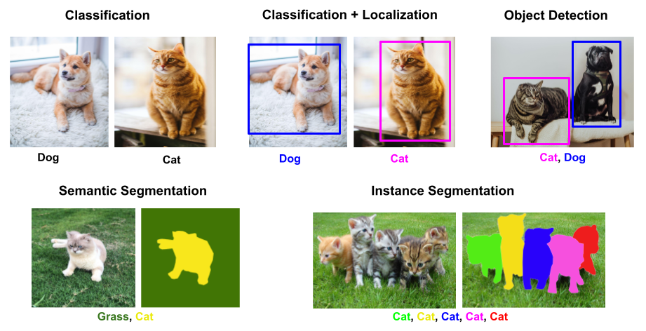
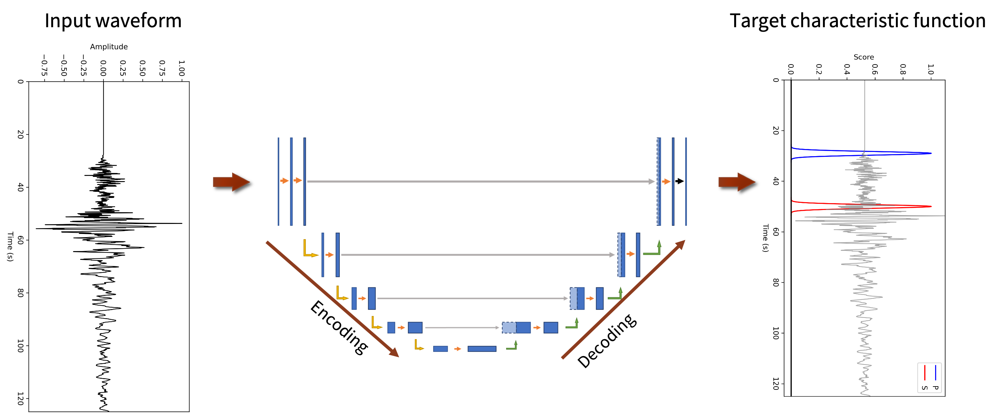
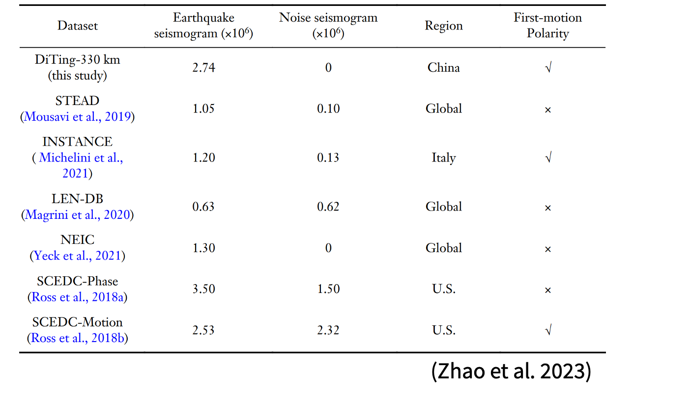
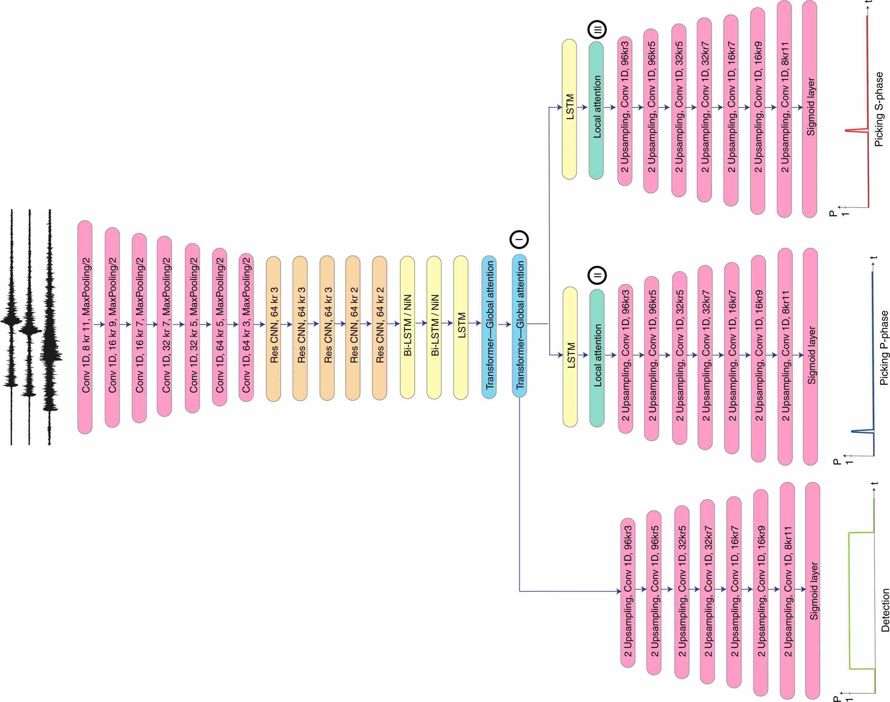
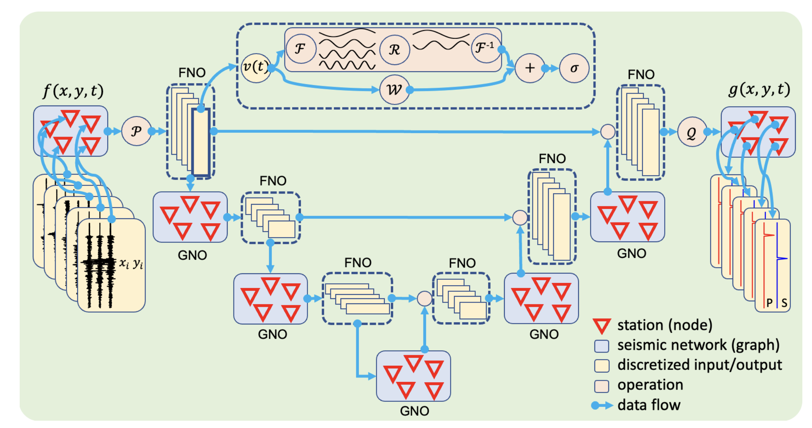

# Observational Seismology

### EPS 207 · Fall 2026

Weiqiang Zhu · Tuesdays 9:00-10:59 · McCone 325

---

<!-- _class: lead -->

# 1 · Earthquakes

---

### Large destructive earthquakes

| Year | Magnitude | MMI |  Deaths | Injuries |                Event               |
|:----:|:---------:|:---:|:-------:|:--------:|:----------------------------------:|
| 2023 | 7.8       | XII | 57,350+ | 130,000+ | 2023 Turkey–Syria earthquake       |
| 2011 | 9.1       | IX  | 19,747  | 6,000    | 2011 Tōhoku earthquake and tsunami |
| 2008 | 7.9       | XI  | 87,587  | 374,177  | 2008 Sichuan earthquake            |

---

### Hayward Fault

[History](https://seismo.berkeley.edu/hayward/hayward_history.html)

---

### [The California Memorial Stadium](https://pressbooks.pub/haywardfaultucberkeley/chapter/the-california-memorial-stadium/)

---

### An estimated magnitude of 6.3 or greater. 

---

<!-- _class: lead -->

# 2 · Before, during, after

---

### Earthquake monitoring and earthquake risk?

- Before an earthquake
- A few seconds after an earthquake
- Hours/days after an earthquake
- Years after an earthquake

---

### Before an earthquake

- [Eathquake Hazard Map](https://earthquake.usgs.gov/earthquakes/map/?extent=27.95559,-130.8252&extent=51.28941,-92.50488&range=month&magnitude=all&showPopulationDensity=true&showUSHazard=true&settings=true)

- Simulating earthquake scenarios
[Hayward Fault Scenarios](https://youtu.be/qZaKE4GuBXs?si=wI949Vnbk1EbO6xT)

---

### A few seconds after

- MyShake
[https://myshake.berkeley.edu/](https://myshake.berkeley.edu/)

- Mobile phones as seismometers
[Android EEW](https://www.youtube.com/watch?v=zFin2wZ56tM&ab_channel=Android)

---

### Hours/days after an earthquake

- Emergency response and damage assessment
[Fault Dimensions](https://www.src.com.au/earthquake-size/)

| Magnitude Mw | Fault Area km² | Typical rupture dimensions (km x km) |
|--------------|----------------|--------------------------------------|
| 4            | 1              | 1 x 1                                |
| 5            | 10             | 3 x 3                                |
| 6            | 100            | 10 x 10                              |
| 7            | 1,000          | 30 x 30                              |
| 8            | 10,000         | 50 x 200                             |

--- 

- [Aftershock prediction](https://earthquake.usgs.gov/data/oaf/overview.php)

---

### Years after an earthquake

- Understand earthquake rupture process
- Improve ground motion prediction models (GMPE)
- Improve hazard map and building codes
- Earthquake forecasting models

<!-- FIXME: figure lost to an expired CDN link; paste a screenshot here -->

---

<!-- _class: lead -->

# 3 · The data

---

### More sensors, recording for longer

[IRIS dataset](https://ds.iris.edu/data/distribution/)

---

### What information can we get from seismic data?

- Take a look at a recent earthquake: [M 5.1 - 7 km SE of Ojai, CA](https://earthquake.usgs.gov/earthquakes/eventpage/ci39645386/executive)

---

<!-- _class: lead -->

# 4 · From waveforms to a catalogue

---

### How is information extracted?

- Detection of earthquakes
- Earthquake origin time and location
- Earthquake magnitude
- Earthquake focal mechanism/moment tensor
- Shake map/ground motion prediction
- Earthquake early warning
- "Did you feel it?"

---

### Detect: is there an earthquake?

- Amplitude threshold
- STA/LTA
- Template matching / Matched filter
- Deep learning

- Pros:
    - Simple and fast
    - More sensitive than amplitude threshold
    - More robust for noisy data

- Cons:
    - More parameters for tuning
    - Prone to false detections

---

### Information from seismic phases

- Earthquake source
- Earth's (Planetary) interior structure
- Subsurface exploration (reservior, geothermal, etc.)
- ...

---

### Picking P and S waves

---

### What is phase association?

---

### Locate: an inverse problem

- Minimize the difference between observed and predicted values

---

### Size it: magnitude

How to quantify the size of an earthquake?

- For historical reasons the most well-known measure of earthquake size is the  earthquake magnitude.
- Derived from the largest amplitude that is recorded on  seismograms.
- There are now many different types of magnitude  scales, but all are connected in some way to the earliest definitions of  magnitude.

The original magnitude scale is based on the maximum amplitude recorded on a standard Wood-Anderson torsion seismograph.

$$
M_L = \log_{10} A(X) - \log_{10} A_0(X)
$$
$A_0$: the amplitude of the reference event
$X$: the epicentral distance

----

An approximate empirical formula has been derived for $\log_{10} A_0(X)$ at different ranges. 
The local magnitude can be calculated by
$$
M_L = \log_{10} A(X) + 2.56 \log_{10} X - 1.67
$$
where $A(X)$ is the displacement amplitude in microns (10$^{-6}$ m) and X is in  kilometers.

- Events below about $M_L 3$ are generally not felt
- Significant damage to structures in California begins to  occur at about $M_L 5.5$
- A $M_L 6.0$ earthquake implies amplitude 100 times greater than a $M_L 4.0$ event.

---

### Fault plane

---

### Focal Mechanism Beachball

<!--  -->

--- 

### Radiation pattern

<!-- footer: "Kumar et al. (2016)" -->

---

<!-- _class: lead -->

# 5 · What a catalogue is for

---

### What can we learn from millions of earthquakes?

- Earthquake catalog
- Earthquake statistics
- Earthquake triggering
- Earthquake forecasting
- Fault zone structure
- Seismic tomography
- Volcano, glacier, and landslide monitoring

---

### How is this information used?

- Monitoring earthquakes and earthquake early warning
- Understand earthquake source physics
- Understanding the Earth's structure
- Applying seismology to environmental science, planetary science, climate science, etc.

---

<!-- _class: lead -->

# 6 · What learning changed

---

### Detection, learned

- Generalized similarity search

--- 

---

### Picking is segmentation

---

### PhaseNet

---

### Large training dataset + Clear objective function

*Figure: [Zhu & Beroza (2018), PhaseNet, GJI](https://doi.org/10.1093/gji/ggy423)*

<!-- FIXME: figure lost to an expired CDN link; paste a screenshot here -->

---

### Clustering-based (Unsupervised), e.g. GaMMA

--- 

### Clustering

---

### Deep Denoiser

- Short-time Fourier Transform (STFT) + Wiener Filter + Neural Network

---

### Deep learning for earthquake statistics

<!-- footer: "Deep learning of aftershock patterns following large earthquakes, Devries et al. 2018" -->

---

### Why machine learning

Deep Learning (Deep Neural Networks) is a new paradigm of software development

- [Software 2.0](https://karpathy.medium.com/software-2-0-a64152b37c35)

- [Universal Approximation Theorem](https://en.wikipedia.org/wiki/Universal_approximation_theorem)

- Neural Networks
- Automatic Differentiation
- Optimization/Inversion

---

<!-- _class: lead -->

# 7 · The catch

---

### A deep net, and a number with no parameters

DeVries et al. (2018, *Nature*) predicted where aftershocks occur from static stress
change, with a 13,451-parameter neural network.

| model | fitted parameters | AUC |
| --- | --- | --- |
| the published network | 13,451 | 0.8486 |
| **max shear stress change** | **0** | **0.8474** |
| logistic regression | 13 | 0.8310 |

Mignan & Broccardo (2019, *Nature*) showed a two-parameter model matches the network.
Measured here: a single stress quantity, **nothing fitted at all**, comes within 0.0012.

---

### How to get +0.067 AUC out of nothing

Same data. Add one extra feature: a **random number, constant within each mainshock**,
carrying no information whatsoever.

| split | what the noise feature is worth |
| --- | --- |
| random split over cells | **+0.067 AUC** |
| split by mainshock | −0.032 AUC |

That is roughly **four times** the entire advantage the deep network was reported to have.

Cells around one mainshock share a rupture and a stress field. Split them at random and
the model reads the answer off the group it is in.

---

### The error bar decides the result

The same comparison, bootstrapped two ways:

| resampled over | 95% interval | reads as |
| --- | --- | --- |
| 1,378,120 cells | [−0.0194, −0.0153] | a clear result |
| **33 independent earthquakes** | **[−0.0280, +0.0059]** | **no result** |

**8.3x wider**, and it now contains zero. The data did not change; the assumption about
what counts as an independent observation did.

So: every week, a **baseline** and an **honest interval**.

---

<!-- _class: lead -->

# 8 · This course

---

### Things to learn in this course

- Familiar with seismic data
- Learn the state-of-the-art machine learning methods for seismic data processing
- Process seismic data, build seismic catalogs, and analyzing seismicity
- Learn basic inverse theory for earthquake location, focal mechanism, seismic tomography, etc.

---

### Schedule

| Date | Seismology | Machine learning |
| --- | --- | --- |
| 09/01 | **Introduction** | *today* |
| 09/08 | Magnitude calibration | Regression & uncertainty |
| 09/15 | Where aftershocks occur | Bias–variance, boosting, CV |
| 09/22 | Fault structure from seismicity | Clustering, mixture models, EM |
| 09/29 | Earthquake / quarry-blast discrimination | NN: classification |
| 10/06 | Phase picking | NN: segmentation |
| 10/13 | Event detection on DAS | NN: object detection |
| 10/20 | Denoising | NN: Denoising |
| 10/27 | Ground-motion prediction | Transformers |
| 11/03 | Template matching | Similarity & embeddings |
| 11/10 | Waveform generation | VAE and Diffusion |
| 11/17 | Focal mechanism & moment tensor | Inversion I — linear |
| 11/24 | Location & relocation | Inversion II — non-linear |
| 12/01 | Tomography | Inversion III — fields |

---

### Final project

**The Geysers** - the most seismically active field in California, where the shaking is
a side effect of an industrial process.

---

### Grading

- Attendance and participation (50%)
- Final project (50%)

---

### Questions?

---

<!-- _class: lead -->

# Appendix

---

<!-- _class: lead -->

# A · Earthquake source

---

### Earthquake faults

Earthquakes may be idealized as movement across a planar fault of arbitrary orientation

- strike: $\phi$, the azimuth of the fault from north where it intersects a horizontal surface
$0^\circ \leq \phi \leq 360^\circ$
- dip: $\delta$, the angle from the horizontal
$0^\circ \leq \delta \leq 90^\circ$
- rake: $\lambda$, the angle between the slip vector and the strike
$0^\circ \leq \lambda \leq 360^\circ$

---

### Earthquake faults

**Thrust faulting**: reverse faulting on faults with dip angles less than 45 
**Overthrust faults**: Nearly horizontal thrust faults
**Strike-slip faulting**: horizontal motion between the fault surfaces
**Dip-slip faulting**: vertical motion
**Right-lateral strike–slip motion**: standing on one side of a fault, sees the adjacent block move to the right
$\lambda = 0^\circ$: left-lateral faulting
$\lambda = 180^\circ$: right-lateral faulting
The San Andreas Fault: Right-lateral fault

---

### Earthquake double couple

- An earthquake is usually modeled as slip on a fault, a discontinuity in displacement across an internal surface in the elastic media.
- Internal forces resulting from an explosion or stress release on a fault must act in opposing directions so as to conserve momentum.
- A force couple is a pair of opposing point forces separated by a small distance 
- A double couple is a pair of complementary couples that produce no net torque

---

### Moment tensor

We define the force couple $M_{ij}$ as a pair of equal and opposite forces pointing in the $i$ direction and separated by a unit distance in the $j$ direction. 

The magnitude of $M_{ij}$ is the product of the force and the distance $f \times d$.

$$
M_{ij} = \begin{bmatrix}
    M_{11} & M_{12} & M_{13} \\
    M_{21} & M_{22} & M_{23} \\
    M_{31} & M_{32} & M_{33}
\end{bmatrix}
$$

The condition that angular momentum be conserved requires that is symmetric (e.g., $M_{ij} = M_{ji}$).

---

### Moment tensor

For example, right-lateral movement on a vertical fault oriented in the $x_1$ direction corresponds to the moment tensor representation

$$
M = \begin{bmatrix}
    M_{11} & M_{12} & M_{13} \\
    M_{21} & M_{22} & M_{23} \\
    M_{31} & M_{32} & M_{33}
\end{bmatrix}
= \begin{bmatrix}
    0 & M_0 & 0 \\
    M_0 & 0 & 0 \\
    0 & 0 & 0
\end{bmatrix}
$$

where $M_0$ is the scalar seismic moment: 

$$
M_0 = \mu d A
$$

where $\mu$ is the shear modulus, $d$ is the average fault displacement, and $A$ is the area of the fault.

The units for $M_0$ are N$\cdot$m (or dyne$\cdot$cm), the same as for force couples.

---

### Global CMT catalog

[Global Centroid Moment Tensor](https://www.globalcmt.org/)

---

### Beach balls

---

### Review: Basic types of faulting

---

### Basic types of faulting

---

### First-motion polarity

---

### Magnitude $M_0$

The magnitude of the equivalent body forces is $M_0$
The scalar seismic moment of the earthquake; units of dyn-cm, or N-m

---

### Global earthquakes: body wave magnitude $m_b$

$$
m_b = \log_{10} (A/T) + Q(h, \Delta)
$$

where A is the ground displacement in microns, T is the dominant period of  the measured waves, $\Delta$ is the epicentral distance in degrees, and Q is an  empirical function of range and event depth h.

- Why $A/T$?
- h?

---

### Global earthquakes: surface wave magnitude $M_s$

For Rayleigh waves on vertical instruments:
$$
M_s = \log_{10} (A/T) + 1.66 \log_{10} \Delta + 3.30
$$

Since the strongest Rayleigh wave arrivals are generally at a period of 20 s, this expression is  often written as
$$
M_s = \log_{10} A_{20} + 2.46 \log_{10} \Delta + 2.0
$$

- Note that this equation is applicable only to shallow events
- surface wave amplitudes are greatly reduced for deep events.

---

### Magnitude saturation

---

### Moment magnitude $M_w$

The saturation of the and scales for large events helped motivate  development of the moment magnitude $M_w$

$$
M_w = \frac{2}{3} (\log_{10} M_0 - 9.1)
$$
where is the moment measured in N-m.

- The advantage of the scale is that it is clearly related to a physical property of the source and it does not saturate for even the largest  earthquakes.
- One unit increase in $M_w$ corresponds to a $10^{3/2} \approx 32$ times increase in the moment.
- A $M_w 7$ earthquake releases about 1000 times more energy than a $M_w 5$ event.

---

### Magnitude as a function of moment

[USGS Magnitude Types](https://www.usgs.gov/programs/earthquake-hazards/magnitude-types); [Latest earthquake](https://earthquake.usgs.gov/earthquakes/eventpage/us7000pn9s/origin/magnitude)

---

### The intensity scale

The local strength of ground shaking as determined by damage to  structures and the perceptions of people who experienced the earthquake.

- One earthquake can have different intensities at different locations.

[USGS Latest Earthquakes](https://earthquake.usgs.gov/earthquakes/map/?extent=26.07652,-136.80176&extent=49.92294,-98.48145&range=month&listOnlyShown=true&settings=true&search=%7B%22name%22:%22Search%20Results%22,%22params%22:%7B%22starttime%22:%222020-12-02%2000:00:00%22,%22endtime%22:%222023-12-09%2023:59:59%22,%22maxlatitude%22:37.642,%22minlatitude%22:37.588,%22maxlongitude%22:-122.344,%22minlongitude%22:-122.412,%22orderby%22:%22time%22%7D%7D)

---

<!-- _class: lead -->

# B · Signal processing

---

### Signal Processing 101

- Fourier Transform (FFT)
- Filtering
- Spectrogram
- Convolution and Cross-correlation
- Short-time Fourier Transform (STFT)
- Wavelet Transform
- Hilbert Transform
- ...

---

### Fourier Transform

Fourier Transform (FT) is a mathematical operation that decomposes a function into its constituent frequencies.

The Fourier Transform of a function $f(t)$ is given by:

$$F(\omega) = \int_{-\infty}^{\infty} f(t) e^{-i\omega t} dt$$

The inverse Fourier Transform is given by:

$$f(t) = \frac{1}{2\pi} \int_{-\infty}^{\infty} F(\omega) e^{i\omega t} d\omega$$

---

$$
\begin{align}
F(\omega) &= \int_{-\infty}^{\infty} f(t) e^{-i\omega t} dt \\
&= \int_{-\frac{1}{2}}^{\frac{1}{2}} e^{-i\omega t} dt \\
&= \frac{1}{-i\omega} \left[ e^{-i\omega t} \right]_{-\frac{1}{2}}^{\frac{1}{2}} \\
&= \frac{1}{-i\omega} \left[ \cos\left(\frac{\omega}{2}\right) - i\sin\left(\frac{\omega}{2}\right) - \cos\left(\frac{\omega}{2}\right) - i\sin\left(\frac{\omega}{2}\right) \right] \\
&= \frac{1}{-i\omega} \left[ -2i\sin\left(\frac{\omega}{2}\right) \right] \\
&= \frac{\sin\left(\frac{\omega}{2}\right)}{\frac{\omega}{2}}
\end{align}
$$

--- 

### Fourier Transform

--- 

### Fourier Analysis

---

### Filtering

Filtering is a process of removing unwanted components or features from a signal.

<!-- FIXME: figure lost to an expired CDN link; paste a screenshot here -->

---

### Convolution

Convolution is a mathematical operation on two functions $f$ and $g$ that produces a third function that expresses how the shape of one is modified by the other.

$$
\begin{align}
(f * g)(t) &= \int_{-\infty}^{\infty} f(\tau) g(t - \tau) d\tau \\
&= \int_{-\infty}^{\infty} f(t - \tau) g(\tau) d\tau \\
\end{align}
$$

---

### Cross-correlation

Cross-correlation is a measure of similarity of two series as a function of the displacement of one relative to the other.

$$
\begin{align}
(f \star g)(t) &= \int_{-\infty}^{\infty} f(\tau) g(t + \tau) d\tau \\
&= \int_{-\infty}^{\infty} f(t + \tau) g(\tau) d\tau \\
\end{align}
$$

---

### Cross-correlation in Frequency Domain

$$
\begin{align}
& \int_{-\infty}^{\infty}\int_{-\infty}^{\infty} f(\tau) g(t + \tau) d\tau e^{-i\omega t}  dt \\
& = \int_{-\infty}^{\infty} f(\tau) \int_{-\infty}^{\infty} g(t + \tau) e^{-i\omega t} dt d\tau \\
& = \int_{-\infty}^{\infty} f(\tau) \int_{-\infty}^{\infty} g(\tau') e^{-i\omega (\tau' - \tau)} d\tau' d\tau, \tau'=t+\tau \\
& = \int_{-\infty}^{\infty} f(\tau) e^{-i (-\omega) \tau} d\tau \int_{-\infty}^{\infty} g(\tau') e^{-i\omega \tau'} d\tau'  \\
& = F(-\omega) G(\omega)
\end{align}
$$

---

### Deep Denoiser for Seismic Data

[Paper](https://drive.google.com/file/d/19g0nyCgAIUPOrQ6sPsU1PPA5B9zhQbBG/view?usp=drive_link)

---

<!-- _class: lead -->

# C · Detection

---

### Amplitude threshold

- PGA (Peak Ground Acceleration)
- PGV (Peak Ground Velocity)
- Displacement

[Recent M4.5 earthquake](https://earthquake.usgs.gov/earthquakes/eventpage/nc73938736/executive)

---

### Amplitude threshold

- Pros:
    - Simple and fast
    - Physical parameter
    - Directly related to shaking/damage
- Cons:
    - Limit to large earthquakes
    - Need backgroud noise level for small earthquakes
- Improvments:
    - How to make the threshold adaptive to the background noise level?

---

### STA/LTA

- STA/LTA = Short-Term Average / Long-Term Average

<!-- FIXME: figure lost to an expired CDN link; paste a screenshot here -->

---

### STA/LTA

---

### Template matching / Matched filter

Review of convolution and cross-correlation in last lecture: [cross-correlation](https://ai4eps.github.io/EPS207_Observational_Seismology/lectures/02_signal_processing.html#12)

Notebook: [cross-correlation](https://ai4eps.github.io/EPS207_Observational_Seismology/lectures/codes/signal_processing/#convolution)

---

### (QTM) Quake Template Matching

--- 

### Template matching / Matched filter

- Pros:
    - Robust to noise
    - More sensitive to small earthquakes
- Cons:
    - High computational cost
    - Need existing catalog to build templates
    - Limited to waveform similarity with templates

---

### Similarity search

--- 

### FAST (Fingerprint And Similarity Thresholding)

--- 

### Similarity search

- Pros:
    - Sensitive to small earthquakes
    - Computational efficient
- Cons:
    - Detect all repeating signals
    - Complex to implement

<!-- FIXME: figure lost to an expired CDN link; paste a screenshot here -->

---

### Deep learning

- Pros:
    - Robust to noise
    - Sensitive to small earthquakes
    - Fast prediction
- Cons:
    - Need large amount of labeled data
    - Black box
    - Generalization ability

---

<!-- _class: lead -->

# D · Phase picking

---

### Seismic waves

---

### Seismic phases

---

### Demo: Segment Anything Model (SAM)

Try the SAM model: [link](https://segment-anything.com/demo)

---

### How to apply deep learning to seismic phase picking?

---

### EQTransformer for simultaneous earthquake detection and phase picking

---

### Next-Generation Seismic Monitoring with Neural Operators (PhaseNO)

---

<!-- _class: lead -->

# E · Association

---

### Grid-search / Back-projection, e.g. REAL

*Figure: [Zhang, Ellsworth & Beroza (2019), Rapid Earthquake Association and Location, SRL](https://doi.org/10.1785/0220190052)*

<!-- FIXME: figure lost to an expired CDN link; paste a screenshot here -->

---

### Graph-Neural-Network-based, e.g. GENIE

*Figure: [McBrearty & Beroza (2023), Earthquake Phase Association with Graph Neural Networks, BSSA](https://doi.org/10.1785/0120220182)*

<!-- FIXME: figure lost to an expired CDN link; paste a screenshot here -->

---

### K-means

---

### Gaussian Mixture Model (GMM)

<!-- FIXME: figure lost to an expired CDN link; paste a screenshot here -->

---

### Gaussian Mixture Model Association (GaMMA)

---

<!-- _class: lead -->

# F · Location and its uncertainty

---

### How to solve an optimization/inversion problem?

- Forward function
- Objective/Loss function
- Gradient
- Optimizer

<!-- ---

<iframe src="https://docs.google.com/presentation/d/e/2PACX-1vTGPzx6m0wBOAta7qebCjW_n_lcXsay3Uqo7iKnVI5cxZNYWcmbTQNgOAwiuTx_ZwRuNRxOHCRBSFsq/embed?start=false&loop=true&delayms=60000" frameborder="0" width="100%" height="105%" allowfullscreen="true" mozallowfullscreen="true" webkitallowfullscreen="true"></iframe>
 -->

---

### Locating earthquake using absolute arrival times

[notebook](https://ai4eps.github.io/EPS207_Observational_Seismology/lectures/codes/earthquake_location/#locating-earthquakes-using-both-absolute-travel-times-and-relative-travel-time-differences)

Earthquake location problem:

- Given:
  - Observed arrival times at multiple stations
  - Velocity model
- Goal:
  - Locate the hypocenter and origin time of the earthquake

---

### Forward function:

$$\hat{t}^i=f^i(\mathbf{m})$$

where $\hat{t}^i$ is the predicted arrival time at station $i$, $f^i$ is the forward non-linear function (e.g., ray tracing or eikonal equation), and $\mathbf{m}$ is the model parameter (e.g., source location, origin time, and velocity).

For a uniform velocity:
$$
\hat{t}^i=f^i(\mathbf{m})=\frac{\sqrt{(x^i-x_0)^2+(y^i-y_0)^2+(z^i-z_0)^2}}{v} + t^i_0
$$
where $(x^i,y^i,z^i)$ is the location of the $i$-th station, $(x_0,y_0,z_0)$ is the location of the source, $t_0$ is the origin time, and $v$ is the uniform velocity.

---

### Objective/Loss function:

The difference between the observed and predicted times is:
$$
r^i=t^i-\hat{t}^i=t^i-f^i(\mathbf{m})
$$

Loss functions:

- Mean squared error (MSE): $\mathcal{L}2= \sum_{i=1}^n\left\|r^i\right\|_2$
- Absolute error: $\mathcal{L}1= \sum_{i=1}^n\left|r^i\right|$
- Huber loss: $\mathcal{L}_{\text {huber }}=\sum_{i=1}^n \begin{cases}\left\|r^i\right\|_2^2 & \text { if } \left\|r^i\right\|_2 \leq \delta \\ 2 \delta\left(\left\|r^i\right\|_2-\frac{\delta}{2}\right) & \text { if } \left\|r^i\right\|_2>\delta\end{cases}$

---

### Iterative location methods

$$
\begin{aligned}
\hat{t}^i(m) &= \hat{t}^i(m_0) + \frac{\partial \hat{t}^i}{\partial m_j}\Delta m_j
\end{aligned}
$$
where $m_0$ is the initial model, $\Delta m_j$ is the perturbation of $(x, y, z, t0, v)$.

$$
\begin{aligned}
r^{m} &= t^i - \hat{t}^i(m) \\
&= t^i - \hat{t}^i(m_0) - \frac{\partial \hat{t}^i}{\partial m_j}\Delta m_j \\
&= r^i(m_0) - \frac{\partial \hat{t}^i}{\partial m_j}\Delta m_j
\end{aligned}
$$

---

### Iterative location methods

We seek to find the $\Delta m$ that 
$$
\begin{aligned}
r^i(m_0) &= \frac{\partial \hat{t}^i}{\partial m_j}\Delta m_j \\
r^i(m_0) &= G \Delta m
\end{aligned}
$$

$\Delta m$ can be obtained using standard least squares. Next, we set $m_0$ to $m_0 + \Delta m$ and repeat the process until the locatin converges.

---

### How to evaluate the results of earthquake location?

How do we define the "best" location?

The average least square residual:
$$
\epsilon = \frac{1}{n_df}\sum_{i=1}^n\left\|t^i-\hat{t}^i\right\|_2
$$
is called the *variance* of the residuals, where $n_{df}$ is the number of degrees of freedom.

A common term is *variance reduction* (VR), which is defined as:
$$
\text{VR} = \frac{\epsilon_{\text{old}}-\epsilon_{\text{new}}}{\epsilon_{\text{old}}} \times 100\%
$$

---

### How to define the uncertainty in the location?

Based on least squares and L2 norm, we define:

$$
\chi^2 = \sum_{i=1}^n\left(\frac{t^i-\hat{t}^i}{\sigma^i}\right)^2
$$

where $\sigma^i$ is the uncertainty of the $i$-th residual.

The $\chi^2$ distribution approximate the degree of freedom of the residuals $n_{df}$.

---

### The $\chi^2$ distribution

The $\chi^2$ distribution is a probability distribution that describes the sum of the squares of independent standard normal random variables.

The probability density function of the $\chi^2$ distribution is:
$$
f(x;k) = \frac{1}{2^{k/2}\Gamma(k/2)}x^{k/2-1}e^{-x/2}
$$

---

### 90% confidence interval of $\chi^2$

The 90% confidence interval of the $\chi^2$ distribution is bounded by:
$$
\chi^2_{0.05;n_{df}} \leq \chi^2 \leq \chi^2_{0.95;n_{df}}
$$

Table for $n_{df}=5, 10, 20, 50, 100$:

| ndf | $\chi^2_{0.05}$ | $\chi^2_{0.50}$ | $\chi^2_{0.95}$ |
|-----|------------------------|-----------------------|------------------------|
| 5   | 0.412                  | 4.35                  | 11.1                  |
| 10  | 3.94                   | 9.34                  | 18.3                  |
| 20  | 10.9                   | 19.3                  | 31.4                  |
| 50  | 34.8                   | 49.3                  | 71.4                  |
| 100 | 77.9                   | 99.3                  | 129.6                 |

---

### How to apply to real data?

Note that the $\sigma^i$ are critical in the analysis, which is based on the assumption that the data misfit are random, uncorrelated, and have a Gaussian distribution.

The estimated **data uncertainty** $\sigma^i$ is often estimated from the residual of the best location:

$$
\sigma^i(m^*) = \frac{1}{n_{df}}\sum_{i=1}^n\left\|t^i-\hat{t}^i\right\|_2
$$
where $m^*$ is the best-fitting location. 

Then we can use the estimated $\sigma^i$ to calculate the $\chi^2$ value; then obtain an estimate of the 95% confidence ellipse for the solution.

---

### Challenges: unmodeled velocity heterogeneity

Case: Earthquakes located along a fault will often be mislocated if the seismic velocity changes across the fault.

---

### Challenges: trade-off between event depth and origin time

Case: Earthquake locations for events outside of a network are often not well constrained.

  
  

Mitigations:

- $S-P$ time can be used to estimate the source-receiver range at each station
- Adding depth phase $pP$ (using the differential time $pP - P$) can help constrain the depth

---

### Locating earthquake using relative arrival times

[notebook](https://ai4eps.github.io/EPS207_Observational_Seismology/lectures/codes/earthquake_location/#locating-earthquakes-using-both-absolute-travel-times-and-relative-travel-time-differences)

In the common situation where the location error is dominated by the biasing effects of unmodeled 3-D velocity structure, the relative location among events within a localized region can be determined with much greater accuracy than the absolute location of any of the events.

---

### [HypoDD: Double-difference earthquake location](https://www.ldeo.columbia.edu/~felixw/hypoDD.html)

$$
\Delta r_k^{i j}=\left(t_k^i-t_k^j\right)-\left(\hat{t}_k^i-\hat{t}_k^j\right)
$$
where $t_k^i$ and $\hat{t}_k^i$ are the observed and predicted arrival times at the $k$-th station for the $i$-th earthquake, respectively.

---

### [GrowClust: A Hierarchical Clustering Algorithm for Relative Earthquake Relocation](https://github.com/dttrugman/GrowClust)

Review: [clusering](https://ai4eps.github.io/EPS207_Observational_Seismology/lectures/05_phase_association.html#6)

---

### More on: Uncertainty

- Aleatoric uncertainty
  - The irreducible part of the uncertainty
  - Uncertainty due to inherent randomness, e.g., the outcome of flipping a coin
- Epistemic uncertainty
  - The reducible part of the uncertainty
  - Uncertainty due to lack of knowledge, e.g., lack of data

---

### Uncertainty Quantification

<!-- - [Bayesian inference](https://en.wikipedia.org/wiki/Bayesian_inference)
- [Monte Carlo simulation](https://en.wikipedia.org/wiki/Monte_Carlo_method) -->
- Standard deviation of slope and intercept of linear regression
- [Bootstrapping](https://en.wikipedia.org/wiki/Bootstrapping_(statistics))
- [Markov Chain Monte Carlo (MCMC)](https://en.wikipedia.org/wiki/Markov_chain_Monte_Carlo)
- [Hamiltonian Monte Carlo (HMC)](https://en.wikipedia.org/wiki/Hamiltonian_Monte_Carlo)
- [Stein Variational Gradient Descent (SVGD)](https://arxiv.org/abs/1608.04471)
- [Dropout as a Bayesian Approximation](https://arxiv.org/abs/1506.02142)

---

### [HypoSVI: Hypocentre inversion with Stein variational inference](https://arxiv.org/abs/2101.03271)

---

<!-- _class: lead -->

# G · Catalogue statistics

---

## The Earthquake Cycle

- Elastic rebound

---

## Spring-block model

When the force exerted by the spring  exceeds the static friction $\mu_s$, the block will slide until the dynamic friction $\mu_d$ balances the reduced level of stress.
If $\mu_s$, $\mu_d$, and $v$ are all constant, then the “earthquakes” will repeat at regular recurrence intervals.

---

## Parkfield earthquake

Significant earthquakes at Parkfield, California, have repeated at  fairly regular intervals since 1850, leading to predictions of another event  before 1993. However the earthquake did not occur until 2004.

---

## Aftershocks

Earthquakes are thought to trigger aftershocks either from the dynamic effects of their radiated seismic waves or the resulting permanent static  stress changes

- The seismicity rate decays with time, following a power law  relationship, called Omori’s law after Omori (1894)

- Coulomb failure function (CFF)
$$CFF = |\tau_s| + \mu (\tau_n + P)$$

where $\tau_s$ is the shear traction on the fault, $\tau_n$ is the normal traction (positive for tension), $P$ is the pore fluid pressure, and $\mu$ is the coefficient of static friction.

<!-- --- -->

<!--  -->

---

### Earthquake Source Parameters

- Magnitude
- Origin time
- Location
- Focal mechanism
- Stress drop
- Energy
- Frequency
- ...

---

### Statistical relationship between source parameters

[wiki](https://en.wikipedia.org/wiki/Aftershock)
- Gutenberg-Richter Law (1944)
- Omori Law (1894)
- Båth's Law (1965)
- The Epidemic Type Aftershock Sequence (ETAS) model (1988)
- ...

---

### The Gutenberg-Richter Law

$$
N=10^{a-b M}
$$
Where:
- $N$ is the number of events greater or equal to $M$
- $M$ is magnitude
- $a$ and $b$ are constants

---

### The Gutenberg-Richter Law

<!-- footer: (Hutton et al. 2010) -->

---

### The Gutenberg-Richter Law

<!-- footer: (Ross et al. 2019) -->

---

### What controls the slope $b$?

<!-- footer: (Scholz 1968) -->

---

### Temporal variation of $b$

<!-- footer: (Gulia and Wiemer 2019) -->

---

### The magnitude completeness ($M_c$)

What affects the magnitude completeness?

- Station coverage
- Background noise
- Detection algorithms
- ...

<!-- footer: (Hutton et al. 2010) -->

---

### Omori Law

$$
n(t) = \frac{K}{c+t}
$$
The number of events $n(t)$ in time $t$ after the mainshock

<!-- footer: (Omori 1894) -->

---

### A modified Omori Law

$$
n(t) = \frac{K}{(c+t)^p}
$$
𝐾: productivity of aftershocks
𝑝: decay rate
c: delay time

<!-- footer: (Ogata 1983) -->

---

### The decay rate $p$

- $p \sim 1.1$
- valid for a long time range
- independent of magnitude

<!--  -->

<!-- footer: (Utsu 2002) -->

---

### The aftershock productivity $K$

- Combined with the Gutenberg-Richter law

$$
K = K_0 10^{b (M_{main} - M)}
$$

$$
n(t, M) = \frac{10^{a + b (M_{main} - M)}}{(c+t)^p}
$$

<!-- footer: (Reasenberg and Jones 1989) -->

---

### The Epidemic Type Aftershock Sequence (ETAS) model

<!-- footer: "" -->

---

### The Epidemic Type Aftershock Sequence (ETAS) model

$$
% g\left(t-t_i, M ; \theta\right)=\frac{K \cdot \exp \left(\beta\left(M-M_c\right)\right)}{\left(t-t_i+c\right)^p}
\lambda(t)=\mu+\sum_{t_i<t} K \cdot \exp \left(\beta\left(M_i-M_c\right)\right) \cdot\left(t-t_i+c\right)^{-p}
$$
- $\mu$ is the background rate
- $K$ is the productivity
- $M_c$ is the magnitude completeness
- $p$ is the decay rate
- $c$ is the delay time
- $\beta$ is the magnitude scaling
- $t_i$ is the occurrence times of previous earthquakes.

<!-- footer: (Ogata 1988) -->

---

### The ETAS model

- Modeling earthquake activity of a Poissonian background and a cluster process
- Analyzing “background” or “clustered” events
- Most widely used model for earthquake forecasting

<!-- footer: (Utsu et al. 1995) -->

---

### Coulomb failure stress (CFS) (Static triggering)

$$
\Delta \sigma_f=\Delta \tau+\mu\left(\Delta \sigma_n+\Delta p\right)
$$
$\Delta \tau$ : change in shear stress
$\Delta \sigma_n$ : change in normal stress (positive for tension)
$\Delta p$ : change in pore pressure
$\mu$ : friction coefficient

<!-- footer: (Stein and Lisowski 1983) -->

---

### Earthquake swarms

“[a sequence] where the number and the magnitude of earthquakes gradually increase with time, and then decreases after a certain period. There is no single predominant principal earthquake” - Mogi (1963)

<!-- footer: "" -->

<!-- ### Clustering analysis of earthquakes

 -->

---

<!-- _class: lead -->

# H · Focal mechanism

---

### How to determine focal mechanism?

**Review: [Inverse Problems in Geophysics](https://ai4eps.github.io/EPS207_Observational_Seismology/lectures/06_location_and_relocation.html#6)**

- Forward function: [last lecture](https://ai4eps.github.io/EPS207_Observational_Seismology/lectures/08_focal_mechanism_and_momemt_tensor/#33-more-specific-example-of-a-fault-described-by-a-double-couple-source)
- Objective/Loss function
- Gradient
- Optimizer

---

### Focal mechanism from first motion polarity

- FPFIT

Objective/Loss function: 
$$
F^{i, j}=\frac{\sum_k \left\{| p_0^{j, k}-p_t^{i, k} \mid \cdot w_0^{j, k} \cdot w_t^{i, k}\right\}}{\sum_k\left\{w_0^{j, k} \cdot w_t^{i, k}\right\}}
$$

$P_0^{j, k} are P_t^{i, k}$ are the observed and theoretical first-motion polarity (0.5 for compression, -0.5 for dilatation).
$w_t^{i, k}=[A(i, k)]^{1 / 2}$ is the square root of the normalized theoretical P-wave radiation amplitude $A(i, k)$ of earthquake $E^j$ recorded at the $k^{\text {th }}$ station for source model $M^i$.

<!-- footer: "Reasenberg (1985)" -->
