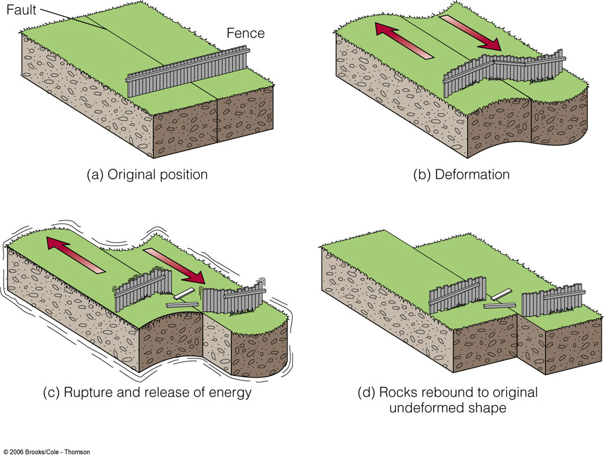

# Earthquake Source and Seismic Wave

Textbooks: 
Shearer, P. M. (2019). Introduction to seismology. Cambridge University Press.
GEOPHYS 210: Earthquake Seismology by Eric Dunham
Segall, P. (2010). Earthquake and volcano deformation. Princeton University Press.

---

### Earthquake faults

Earthquakes may be idealized as movement across a planar fault of arbitrary orientation

- strike: $\phi$, the azimuth of the fault from north where it intersects a horizontal surface
$0^\circ \leq \phi \leq 360^\circ$
- dip: $\delta$, the angle from the horizontal
$0^\circ \leq \delta \leq 90^\circ$
- rake: $\lambda$, the angle between the slip vector and the strike
$0^\circ \leq \lambda \leq 360^\circ$

---

### Earthquake faults

**Thrust faulting**: reverse faulting on faults with dip angles less than 45 
**Overthrust faults**: Nearly horizontal thrust faults
**Strike-slip faulting**: horizontal motion between the fault surfaces
**Dip-slip faulting**: vertical motion
**Right-lateral strike–slip motion**: standing on one side of a fault, sees the adjacent block move to the right
$\lambda = 0^\circ$: left-lateral faulting
$\lambda = 180^\circ$: right-lateral faulting
The San Andreas Fault: Right-lateral fault

---

### Earthquake double couple

- An earthquake is usually modeled as slip on a fault, a discontinuity in displacement across an internal surface in the elastic media.
- Internal forces resulting from an explosion or stress release on a fault must act in opposing directions so as to conserve momentum.
- A force couple is a pair of opposing point forces separated by a small distance 
- A double couple is a pair of complementary couples that produce no net torque

---

### Moment tensor

We define the force couple $M_{ij}$ as a pair of equal and opposite forces pointing in the $i$ direction and separated by a unit distance in the $j$ direction. 

The magnitude of $M_{ij}$ is the product of the force and the distance $f \times d$.

$$
M_{ij} = \begin{bmatrix}
    M_{11} & M_{12} & M_{13} \\
    M_{21} & M_{22} & M_{23} \\
    M_{31} & M_{32} & M_{33}
\end{bmatrix}
$$

The condition that angular momentum be conserved requires that is symmetric (e.g., $M_{ij} = M_{ji}$).

---

### Moment tensor

For example, right-lateral movement on a vertical fault oriented in the $x_1$ direction corresponds to the moment tensor representation

$$
M = \begin{bmatrix}
    M_{11} & M_{12} & M_{13} \\
    M_{21} & M_{22} & M_{23} \\
    M_{31} & M_{32} & M_{33}
\end{bmatrix}
= \begin{bmatrix}
    0 & M_0 & 0 \\
    M_0 & 0 & 0 \\
    0 & 0 & 0
\end{bmatrix}
$$

where $M_0$ is the scalar seismic moment: 

$$
M_0 = \mu d A
$$

where $\mu$ is the shear modulus, $d$ is the average fault displacement, and $A$ is the area of the fault.

The units for $M_0$ are N$\cdot$m (or dyne$\cdot$cm), the same as for force couples.

---

### Global CMT catalog

[Global Centroid Moment Tensor](https://www.globalcmt.org/)

---

---

### Beach balls

---

### Moment tensor

Because $M_{ij} = M_{ji}$, there are two fault planes that correspond to a double-couple model. 
In general, there are two fault planes that are consistent with distant seismic observations in the double-couple model.
**The primary fault plane**: The real fault plane
**The auxiliary fault plane**: The other plane

---

### Eigenvectors

The moment tensor $M_{ij}$ is a symmetric tensor, so it has three real eigenvalues and three orthogonal eigenvectors.

Tension axis $T$
Pressure axis $P$

---

### Non-double couple sources

Isotropic part of $M$: $M^{o} = \frac{1}{3} \text{tr}(M) I$

$$
M^{o} = \begin{bmatrix}
    M_{11} & 0 & 0 \\
    0 & M_{22} & 0 \\
    0 & 0 & M_{33}
\end{bmatrix}
$$
where $M_{11} = M_{22} = M_{33}$

Decomposing $M$ into isotropic and deviatoric parts: $M = M^{o} + M'$
where $\text{tr}(M') = 0$, free from isotropic sources by may contain non-double couple sources

---

### Non-double couple sources

Diagonalize $M'$ by rotating to coordinates of principal axes:

$$
M' = \begin{bmatrix}
    \sigma_1 & 0 & 0 \\
    0 & \sigma_2 & 0 \\
    0 & 0 & \sigma_3
\end{bmatrix}
$$
where $\sigma_1 \geq \sigma_2 \geq \sigma_3$.

Because $tr(M') = 0$, $\sigma_1 + \sigma_2 + \sigma_3 = 0$. 
For a pure double couple source, $\sigma_2 = 0$ and $\sigma_1 = -\sigma_3$.

---

### Non-double couple sources

We can decompose $M'$ into a best-fitting double couple $M^{DC}$ and a non-double couple part $M^{CLVD}$:

$$
\begin{aligned}
M' &= M^{DC} + M^{CLVD} \\
&= \begin{bmatrix}
    (\sigma_1 - \sigma_3)/2 & 0 & 0 \\
    0 & 0 & 0 \\
    0 & 0 & -(\sigma_1 - \sigma_3)/2
\end{bmatrix} 
+ \begin{bmatrix}
    -\sigma_2/2 & 0 & 0 \\
    0 & \sigma_2 & 0 \\
    0 & 0 & -\sigma_2/2
\end{bmatrix}
\end{aligned}
$$

The complete decomposition of the original $M$ is:

$$
M = M^{o} + M^{DC} + M^{CLVD}
$$

---

### Non-double couple sources

Example of the decomposition of a moment tensor into isotropic, best-fitting double couple, and compensated linear vector dipole terms:

The decomposition of $M'$ into $M^{DC}$ and $M^{CLVD}$ is unique because we have defined $M^{DC}$ as the best-fitting double couple, i.e., minimizing the CLVD part.

---

### Non-double couple sources

A measure of the misfit between $M'$ and a pure double-couple source is provided by the ratio $\sigma_2$ to the remaining eigenvalue with the largest magnitude to the largest eigenvalue of $M'$

$$
\epsilon = \frac{|\sigma_2|}{\max(|\sigma_1|, |\sigma_3|)}
$$

$\epsilon = 0$: pure double couple
$\epsilon = \pm 0.5$: close to pure CLVD

Physically, non-double-couple components can arise from simultaneous faulting on faults of different orientations or on a curved fault surface.

---

### Green's function

Review:

The momentum equation:

$$
\rho \frac{\partial^2 u}{\partial t^2} = \partial_i \tau_{ij} + f_i
$$

The stress-strain relation:

$$
\tau_{ij} = \lambda \delta_{ij} \partial_k u_k + 2 \mu \varepsilon_{ij}
$$

The strain:

$$
\varepsilon_{ij} = \frac{1}{2} \left( \partial_i u_j + \partial_j u_i \right)
$$

---

### Green's function

We consider a unit impulse source $f_i(x_0, t_0) = \delta(t - t_0) \delta(x-x_0)$ at point $x_0$ at time $t_0$.

The unit force function is a useful concept because more realistic sources can be described as a sum of these force vectors.

For every $f(x_0, t_0)$, there is a unique $u(x, t)$ that describes the Earth’s response, which could be computed if we knew the Earth’s structure to sufficient accuracy.

---

### Green's function

We define the notation:

$$
u_i(x, t) =  G_{ij}(x, t; x_0, t_0) f_j(x_0, t_0)
$$
where $G_{ij}$ is the Green's function, $u_i$ is the displacement, and $f_j$ is the force.

Assuming that $G_{ij}$ can be computed, the displacement resulting from any body force distribution can be computed as the sum or superposition of the solutions for the individual point sources.

---

### Green's function + Moment tensor

The moment tensor provides a general representation of the internally generated forces that can act at a point in an elastic medium. Although it is an idealization, it has proven to be a good approximation for modeling the distant seismic response for sources that are small compared to the observed seismic wavelengths.

So the displacement $u_i$ resulting from a force couple at $x_0$ is given by:

$$
\begin{aligned}
u_i(x, t) &= G_{ij}(x, t; x_0, t_0) f_j(x_0, t_0) - G_{ij}(x, t; x_0-\hat{d}, t_0) f_j(x_0, t_0) \\
&= \frac{\partial G_{ij}(x, t; x_0, t_0)}{\partial x_{0k}} \hat{d}_k f_j(x_0, t_0) \\
u_i(x, t) &= \frac{\partial G_{ij}(x, t; x_0, t_0)}{\partial x_{0k}} M_{jk}
\end{aligned}
$$

---

### Radiation patterns

Solving for the Green's function is rather complicated. Here we consider the simple case of a spherical wavefront from an isotropic source.
Review: The solution for the P-wave potential:
$$
\phi(r, t) = \frac{-f(t-r/\alpha)}{r}
$$
where $\alpha$ is the P-wave velocity, $r$ is the distance from the point source, and $4\pi\delta(r)f(t)$ is the source-time function.

The displacement field = the gradient of the displacement potential:
$$
u(r, t) = \frac{\partial \phi(r, t)}{\partial r} = \frac{1}{r^2} f(t-r/\alpha) - \frac{1}{r} \frac{\partial f(t-r/\alpha)}{\partial r}
$$

---

### Radiation patterns

Define $\tau = t - r/\alpha$ as the delay time:
$$
\frac{\partial f(t-r/\alpha)}{\partial r} = \frac{\partial f(t-r/\alpha)}{\partial \tau} \frac{\partial \tau}{\partial r} = -\frac{1}{\alpha} \frac{\partial f(t - r/\alpha)}{\partial \tau} 
$$
So the displacement field is:
$$
u(r, t) = \frac{1}{r^2} f(t-r/\alpha) + \frac{1}{r\alpha} \frac{\partial f(t-r/\alpha)}{\partial \tau}
$$ 

The first term decays as $1/r^2$, and is called the near-field term, which represents the permanent static displacement due to the source
The second term decays as $1/r$, and is called the far-field term, which represents the dynamic response (the transient seismic waves radiated by the source that cause no permanent displacement)

---

### Radiation patterns

$$
u(r, t) = \frac{1}{r^2} f(t-r/\alpha) + \frac{1}{r\alpha} \frac{\partial f(t-r/\alpha)}{\partial \tau}
$$ 

The first term decays as $1/r^2$, and is called the near-field term, which represents the permanent static displacement due to the source

The second term decays as $1/r$, and is called the far-field term, which represents the dynamic response - the transient seismic waves radiated by the source. 
These waves cause no permanent displacement, and their displacements are given by the first time derivative of the source-time function.

---

### Radiation patterns

Most seismic observations are made at sufficient distance from faults that only the far-field terms are important.
Consider the far-field P-wave displacement for a double-couple source, assuming the fault is in the $x_1, x_2$ plane with motion in the $x_1$ direction:

$$\mathbf{u}^P=\frac{1}{4 \pi \rho \alpha^3} \sin 2 \theta \cos \phi \frac{1}{r} \dot{M}_0\left(t-\frac{r}{\alpha}\right) \hat{\mathbf{r}}$$

---

### The far-field radiation pattern for P-waves

- The fault plane and the auxiliary fault plane form nodal lines of zero motion. 
- The outward pointing vectors in the compressional quadrant. 
- The inward pointing vectors in the dilatational quadrant. 
- The tension (T axis) is in the middle of the compressional quadrant; 
- The pressure (P axis) is in the middle of the dilatational quadrant.

---

### The far-field radiation pattern for S-waves

The far-field S displacements:
$$\mathbf{u}^S(\mathbf{x}, t)=\frac{1}{4 \pi \rho \beta^3}(\cos 2 \theta \cos \phi \hat{\boldsymbol{\theta}}-\cos \theta \sin \phi \hat{\boldsymbol{\phi}}) \frac{1}{r} \dot{M}_0\left(t-\frac{r}{\beta}\right)$$
where $\beta$ is the S-wave velocity.

There are no nodal planes, but there are nodal points. 
S-wave polarities generally point toward the T axis and away from the P axis.

---

### Beach balls

---

### Plotting beach balls

Projection of the focal sphere onto an equal-area lower-hemisphere map.
The numbers around the outside circle show the fault strike in degrees.
The circles show fault dip angles with 0° dip (a horizontal fault) to 90° dip (a vertical fault).
The curved line ABC shows the intersection of the fault with the focal sphere.

---

### Review: Basic types of faulting

---

### Basic types of faulting

---

### Body force

---

### First-motion polarity

---

### Radiation pattern

---

### Radiation pattern

---

### Earthquake Focal Mechanism

---

### Earthquake Focal Mechanism

---

### Earthquake Focal Mechanism

---

### Earthquake Focal Mechanism

---

### Earthquake Focal Mechanism

---

### Earthquake Focal Mechanism

---

### P/T axes v.s. Compressional/Dilatational quadrants

The Pressure/Tension (P/T) axes are defined inside the beach ball;
The Compressional/Dilatational quadrants are defined outside the beach ball;

The tension (T axis) is in the middle of the compressional quadrant;
The pressure (P axis) is in the middle of the dilatational quadrant.

---

### Moment tensor and Beach ball

---

### Moment tensor and Radiation pattern

---

### Moment tensor decomposition

---

### Magnitude $M_0$

The magnitude of the equivalent body forces is $M_0$
The scalar seismic moment of the earthquake; units of dyn-cm, or N-m

---

### Time-dependent seismic moment $M(t)$

**The Haskell source model**

The rise time: $\tau_r$ describes the slip duration at any point on a fault.

---

### Rupture propagation

For a long, narrow fault, we assume that the rupture propagates along the fault of length $L$ from left to right at a rupture velocity $v_r$
The total duration $\tau_d$ of the rupture is $T = L/v_r$

--- 

### Far field the apparent rupture time

The apparent rupture duration time $\tau_{\alpha}$ for P-waves:
Rupturing directly toward us: $\tau_{\alpha}(\text{toward}) = L \left( \frac{1}{v_r} - \frac{1}{\alpha} \right)$
Rupturing directly away from us: $\tau_{\alpha}(\text{away}) = L \left( \frac{1}{v_r} + \frac{1}{\alpha} \right)$

---

### Doppler effect

<iframe width="100%" height="500px" src="https://www.youtube.com/embed/imoxDcn2Sgo?si=P_TER2KTW9rco1KS&amp;start=7" title="YouTube video player" frameborder="0" allow="accelerometer; autoplay; clipboard-write; encrypted-media; gyroscope; picture-in-picture; web-share" referrerpolicy="strict-origin-when-cross-origin" allowfullscreen></iframe>

---

### General apparent rupture duration

The apparent rupture duration for a seismic phase with local horizontal phase velocity $c$ at the observing station as
$$
\tau_c(\theta) = L \left( \frac{1}{v_r} - \frac{\cos \theta}{c} \right)
$$
where $\theta$ is the station azimuth relative to the rupture direction. 

The changes in $\tau_c$ as a function of receiver location are termed directivity effects.

---

### Rupture Length

Since $\tau_\text{max} = L \left( \frac{1}{v_r} - \frac{1}{c} \right)$ and $\tau_\text{min} = L \left( \frac{1}{v_r} + \frac{1}{c} \right)$
The rupture length $L$ is
$$
L = \frac{1}{2} (\tau_\text{max} - \tau_\text{min}){c}
$$
The true rupture duration is 
$$
\tau_d = L/v_r = \frac{1}{2} (\tau_\text{max} + \tau_\text{min})
$$
The average rupture velocity is
$$
v_r = L/\tau_d = \frac{\tau_\text{max} - \tau_\text{min}}{\tau_\text{max} + \tau_\text{min}} c
$$

---

### Example: 2004 Sumatra Earthquake Directivity

High-frequency (2–4 Hz) envelopes from teleseismic P-wave observations of the 2004 Sumatra earthquake.

---

### Example: 2004 Sumatra Earthquake Directivity

We have $\tau_{\text{min}} \simeq 400$s, $\tau_{\text{max}} \simeq 600$; and assume $c = 12.6 \text{ km/s}$, so:
* $L = \frac{1}{2} (\tau_\text{max} - \tau_\text{min}){c} = 1/2 \times 200 \times 12.6 = 1260$ km
* $\tau_d = \frac{1}{2} (\tau_\text{max} + \tau_\text{min}) = 500$ s
* $v_r = L/\tau_d = 1260/500 = 2.52$ km/s

---

### Rupture velocity

The rupture velocity is generally observed to be somewhat less than the shear-wave velocity for most earthquakes. 
Anomalously fast ruptures sometimes exceed the local S-wave velocity and are termed supershear ruptures.

---

### Earthquake rupture simulation

<video src="assets/rough_vy.mp4" controls width="80%"></video>
[Eric Dunham](https://pangea.stanford.edu/~edunham/publications.html)

---

### Earthquake faults

Earthquakes may be idealized as movement across a planar fault of arbitrary orientation

- strike: $\phi$, the azimuth of the fault from north where it intersects a horizontal surface
$0^\circ \leq \phi \leq 360^\circ$
- dip: $\delta$, the angle from the horizontal
$0^\circ \leq \delta \leq 90^\circ$
- rake: $\lambda$, the angle between the slip vector and the strike
$0^\circ \leq \lambda \leq 360^\circ$

---

### Earthquake Focal Mechanism

---

### Moment tensor decomposition

---

### Earthquake rupture

**The Haskell source model**

$\tau_r$: the rise time, describes the slip duration at any point on a fault.
$\tau_d$: the duration of the rupture ($L/v_r$)

---

### Earthquake Magnitude

How to quantify the size of an earthquake?

* For historical reasons the most well-known measure of earthquake size is the  earthquake magnitude.
* Derived from the largest amplitude that is recorded on  seismograms.
* There are now many different types of magnitude  scales, but all are connected in some way to the earliest definitions of  magnitude.

---

### Richter Magnitude (Local magnitude $M_L$)

The original magnitude scale is based on the maximum amplitude recorded on a standard Wood-Anderson torsion seismograph.

$$
M_L = \log_{10} A(X) - \log_{10} A_0(X)
$$
$A_0$: the amplitude of the reference event
$X$: the epicentral distance

----

### Richter Magnitude (Local magnitude $M_L$)

An approximate empirical formula has been derived for $\log_{10} A_0(X)$ at different ranges. 
The local magnitude can be calculated by
$$
M_L = \log_{10} A(X) + 2.56 \log_{10} X - 1.67
$$
where $A(X)$ is the displacement amplitude in microns (10$^{-6}$ m) and X is in  kilometers.

* Events below about $M_L 3$ are generally not felt
* Significant damage to structures in California begins to  occur at about $M_L 5.5$
* A $M_L 6.0$ earthquake implies amplitude 100 times greater than a $M_L 4.0$ event.

---

### Global earthquakes: body wave magnitude $m_b$

$$
m_b = \log_{10} (A/T) + Q(h, \Delta)
$$

where A is the ground displacement in microns, T is the dominant period of  the measured waves, $\Delta$ is the epicentral distance in degrees, and Q is an  empirical function of range and event depth h.

* Why $A/T$?
* h?

---

### Global earthquakes: surface wave magnitude $M_s$

For Rayleigh waves on vertical instruments:
$$
M_s = \log_{10} (A/T) + 1.66 \log_{10} \Delta + 3.30
$$

Since the strongest Rayleigh wave arrivals are generally at a period of 20 s, this expression is  often written as
$$
M_s = \log_{10} A_{20} + 2.46 \log_{10} \Delta + 2.0
$$

* Note that this equation is applicable only to shallow events
* surface wave amplitudes are greatly reduced for deep events.

---

### Magnitude saturation

---

### The Haskell fault model

---
### Source spectra

A boxcar pulse in the time domain produces a sinc function in  the frequency domain: $\text{sinc}(x) = \frac{\sin(x)}{x}$

---

### Source spectra

The far-field amplitude spectrum for the Haskell fault model  may be expressed as

$$
|A(\omega)|=g M_0\left|\operatorname{sinc}\left(\omega \tau_r / 2\right)\right|\left|\operatorname{sinc}\left(\omega \tau_d / 2\right)\right|,
$$

where $g$ is a scaling term that includes geometrical spreading, etc

$$
\log |A(\omega)|=G+\log \left(M_0\right)+\log \left|\operatorname{sinc}\left(\omega \tau_r / 2\right)\right|+\log \left|\operatorname{sinc}\left(\omega \tau_d / 2\right)\right|
$$

where $G=\log g$. 

---

### Source spectra

We can approximate $\left|\operatorname{sinc} x\right| \simeq 1$ for $x<1$ and $1/x$ for $x>1$

$$
\log |A(\omega)|-G = \log \left(M_0\right)+\log \left|\operatorname{sinc}\left(\omega \tau_r / 2\right)\right|+\log \left|\operatorname{sinc}\left(\omega \tau_d / 2\right)\right|
$$

$$
\begin{aligned} \log |A(\omega)|-G & =\log M_0, & & \omega<2 / \tau_d \\ & =\log M_0-\log \frac{\tau_d}{2}-\log \omega, & & 2 / \tau_d<\omega<2 / \tau_r \\ & =\log M_0-\log \frac{\tau_d \tau_r}{4}-2 \log \omega, & & 2 / \tau_r<\omega\end{aligned}
$$

---

### The amplitude spectrum for the Haskell fault model.

$$
\begin{aligned} \log |A(\omega)|-G & =\log M_0, & & \omega<2 / \tau_d \\ & =\log M_0-\log \frac{\tau_d}{2}-\log \omega, & & 2 / \tau_d<\omega<2 / \tau_r \\ & =\log M_0-\log \frac{\tau_d \tau_r}{4}-2 \log \omega, & & 2 / \tau_r<\omega\end{aligned}
$$

---

### Magnitude saturation

---

### Moment magnitude $M_w$

The saturation of the and scales for large events helped motivate  development of the moment magnitude $M_w$

$$
M_w = \frac{2}{3} (\log_{10} M_0 - 9.1)
$$
where is the moment measured in N-m.

* The advantage of the scale is that it is clearly related to a physical property of the source and it does not saturate for even the largest  earthquakes.
* One unit increase in $M_w$ corresponds to a $10^{3/2} \approx 32$ times increase in the moment.
* A $M_w 7$ earthquake releases about 1000 times more energy than a $M_w 5$ event.

---

### Magnitude as a function of moment

[USGS Magnitude Types](https://www.usgs.gov/programs/earthquake-hazards/magnitude-types); [Latest earthquake](https://earthquake.usgs.gov/earthquakes/eventpage/us7000pn9s/origin/magnitude)

---

---

---

### The intensity scale

The local strength of ground shaking as determined by damage to  structures and the perceptions of people who experienced the earthquake.

* One earthquake can have different intensities at different locations.

[USGS Latest Earthquakes](https://earthquake.usgs.gov/earthquakes/map/?extent=26.07652,-136.80176&extent=49.92294,-98.48145&range=month&listOnlyShown=true&settings=true&search=%7B%22name%22:%22Search%20Results%22,%22params%22:%7B%22starttime%22:%222020-12-02%2000:00:00%22,%22endtime%22:%222023-12-09%2023:59:59%22,%22maxlatitude%22:37.642,%22minlatitude%22:37.588,%22maxlongitude%22:-122.344,%22minlongitude%22:-122.412,%22orderby%22:%22time%22%7D%7D)

---

### The Mercalli intensity scale (MMI)

---

### JMA intensity scale

---

### Self-Similar Earthquake Scaling

---

### Earthquake Energy Partitioning

---

### Earthquake rupture ([notebook](codes/spring_slider/))

<!--  -->

---

<video src="./assets/GIF_1-BlockEQMachine_Graph.mp4" controls width="80%"></video>

---

### Seismic wave propagation ([notebook](codes/wave_propagation/))

| P-wave | S-wave |
|:---:|:---:|
|  |  |

<!-- ---

---

 -->

<!-- --- -->

<!-- ## Earthquake recurrence model

( Shimazaki and Nakata, 1980) -->

