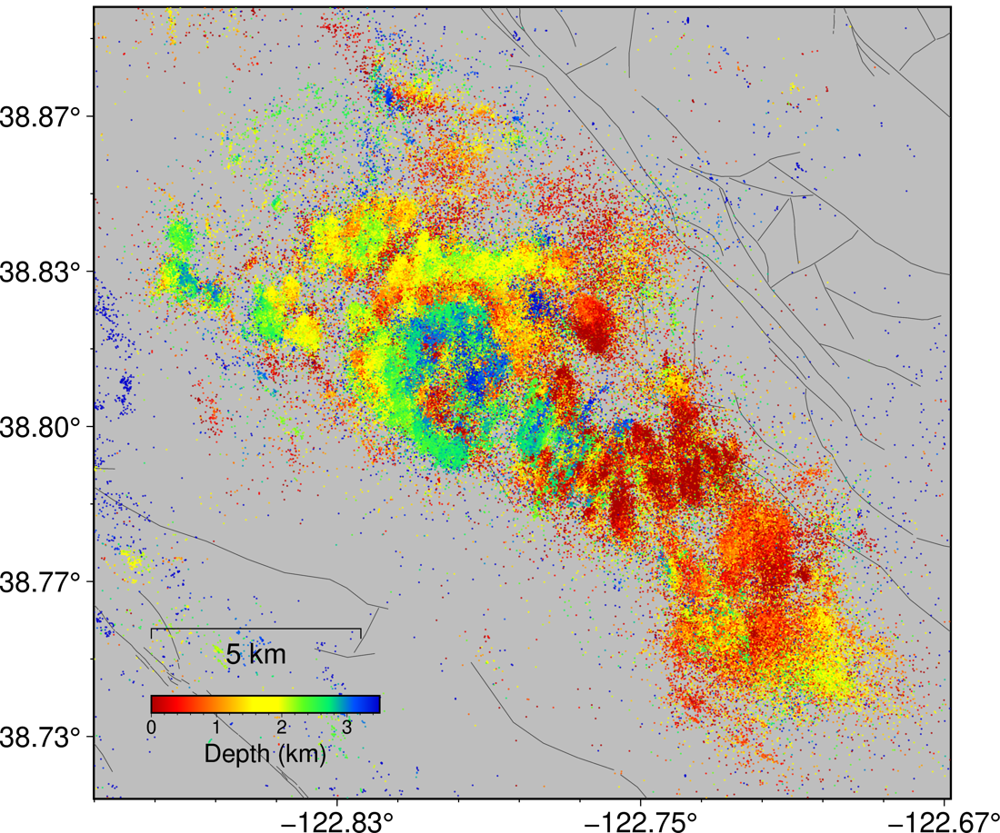

# Final project — The Geysers

Everyone works the same field. You choose the question.

*Relocated seismicity, coloured by depth. The field is about 15 km across and almost everything is
shallower than 3.5 km. Black lines are mapped faults.*

## Why this field

**The Geysers** is the largest geothermal field in the world and the most seismically active place in
northern California: **593,172 relocated events between 2000 and 2025**, almost all shallower than
3.5 km, inside a box about 15 km across.

Two things make it unusually good for a first research project.

**The forcing is partly known.** The seismicity is induced by water injected into the reservoir, and
injection is *seasonal* — it rises in winter, and rose sharply again when the Santa Rosa wastewater
pipeline came online in 2003. Trugman, Shearer & Borsa (2016) found the background rate is highly
correlated with injection, rising about 50% with strong seasonal fluctuation after the pipeline
(`10.1002/2015jb012510`). **That annual cycle is visible in the catalogue itself**, so you can study
the forcing without ever obtaining a well record.

**The field argued about it and changed its mind.** Eberhart-Phillips & Oppenheimer (1984) analysed
the first decade and reported *"no consistent pattern of correlation between injection and
seismicity"* (`10.1029/jb089ib02p01191`). Forty years of denser catalogues later, the correlation is
taken as established, and the discussion has moved to lag and mechanism: Leptokaropoulos et al.
(2018) find peak correlation at a **≈2 week** delay (`10.1093/gji/ggx481`), while Johnson, Totten &
Bürgmann (2016) track a seasonal signal migrating **downward, ≤6 months to reach >3 km below the
injection depth** (`10.1002/2016gl069546`). A good project should be able to say *why* 1984 saw
nothing — and what would have been needed to see it.

## Questions

Each one is live in the literature. Each names the sessions whose methods apply, and the baseline you
must beat or show to be sufficient.

**1 · How long does the reservoir take to respond, and does the lag depend on depth?**
The published answers disagree by an order of magnitude — ≈2 weeks field-wide, up to 6 months at
depth. Measure the annual cycle in the catalogue, then measure its phase as a function of depth.
*Weeks 1, 3.* **Baseline:** a single field-wide lag. Show that depth-dependence is resolvable.

**2 · Why did 1984 see no correlation?**
Sub-sample your catalogue down to 1980s completeness and station coverage, and find out what it
takes to make the modern signal disappear. This is a question about detection, not about the Earth.
*Weeks 1, 6.* **Baseline:** the full catalogue result, degraded step by step.

**3 · Does the *b*-value track injection, and is the variation resolvable?**
Reported *b* at The Geysers is high and varies: 1.18 ± 0.06 under rising injection against 1.10 ±
0.05 under falling (Leptokaropoulos et al. 2018, `10.1007/s11600-018-0215-1`), while
Martínez-Garzón et al. (2014) report *b* **falling** at peak injection (`10.1002/2014jb011385`).
They disagree. Confront it with σ_b = b/√N: with your *N*, is a difference of 0.08 detectable at all?
*Week 1.* **Baseline:** one *b* for the whole field, all time.

**4 · What are the faults, and do they survive a change of method?**
593,172 points is a dense 3-D cloud. Recover planes and compare with mapped structures.
*Week 4.* **Baseline:** *k*-means, which cannot find planes. Show why, then do better.

**5 · Is the field deepening?**
Twenty-five years of production cools and depressurises the reservoir, and depth distributions are
reported to change. Separate a real change from a change in what the network can detect.
*Weeks 1, 3.* **Baseline:** fixed depth distribution, time-varying detection threshold.

**6 · Are there repeating earthquakes, and do they track the season?**
Cross-correlate waveforms, build families, ask whether recurrence follows the injection cycle.
*Weeks 9, 11.* **Baseline:** catalogue locations alone — are "repeaters" merely nearby events?

**7 · What does a machine-learning catalogue add, and what does it get wrong?**
A deep-learning catalogue finds far more events than a routine network catalogue. Where do the extra
events come from — smaller magnitudes, busier periods, particular places? Which do you not believe?
*Weeks 6, 9.* **Baseline:** the routine catalogue. A genuine evaluation problem.

**8 · Can next month's rate be forecast?**
Shcherbakov (2024) models induced rate as a convolution of forcing with a response kernel
(`10.1785/0220240157`). Try it with the seasonal cycle as the forcing. The honest result may be that
you cannot beat persistence.
*Weeks 2, 3.* **Baseline:** next month equals this month. Beat it under a split that respects time.

**9 · Are the sources ordinary earthquakes?**
About 65% of Geysers events carry non-double-couple components above 25%, larger near wells and
during high injection (Martínez-Garzón et al. 2017, `10.1002/2016gl071963`). Test on your own events.
*Week 12.* **Baseline:** a pure double-couple fit — show what it fails to explain.

Bring your own question if you have one. It must be answerable with these data in the time available.
